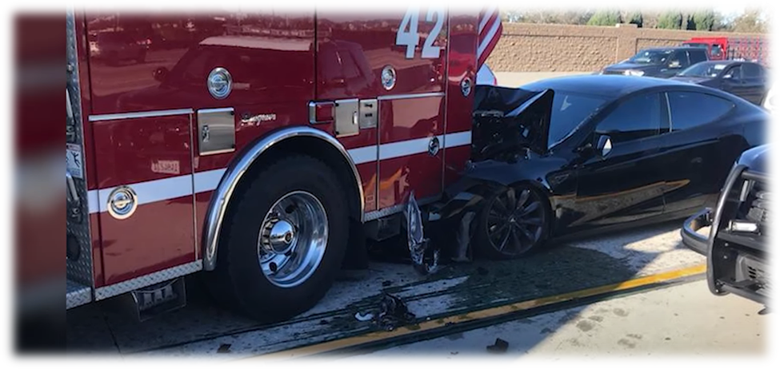

# Tesla-Safety-Assessment-Dashboard

## Tesla Accidents Impact from April 2013 to January 2024

### Executive Summary

### Background

Tesla has dramatically transformed the electric vehicle industry. This data science project utilizes advanced statistical methods such as Linear Regression, Decision Trees, and Autoregression models to explore how factors like model type, geographic location, and Autopilot usage influence accident severity and frequency. The insights generated aim to assist Tesla and regulatory bodies in enhancing vehicle safety and shaping effective future regulations.

### Problem Statement

Recent data from Fox Business shows that Tesla drivers had the highest accident rate between November 14, 2022, and November 14, 2023. This study extends the analysis from April 2013 to January 2024 to better understand the safety impacts of different Tesla models. It will examine correlations between model type, geographic location, Autopilot usage, and accident outcomes.

### Objectives

The primary objective of this project is to analyze Tesla accident data using advanced statistical methods to predict outcomes and identify key factors influencing accident dynamics. The findings aim to provide actionable insights that could improve safety features and inform regulatory decisions, thereby advancing electric vehicle safety and supporting both Tesla and automotive safety authorities in enhancing public safety.

### Data Overview
- **Data Source and KPIs**
  
The dataset for this project was sourced from TeslaAccidents.com, which meticulously tracks and documents Tesla-related accidents globally. This resource provides detailed data essential for analyzing the impact of variables like vehicle model, location, and Autopilot usage on the safety performance of Tesla's models.

- **Data Collection Methods**

In this project, advanced data analytics techniques were utilized to construct a sophisticated predictive framework using a combination of tools. Excel was employed for data organization, Python for data analysis and modeling, and Microsoft Power BI for data visualization, all integrated through Microsoft Fabric to enhance user interaction and interface design.

- **Data Features**

The autoregression model for analyzing Tesla accident data incorporates key features such as time series data, vehicle models, specific locations, involvement of other vehicle occupants, Tesla driver demographics, Autopilot usage, deaths, and accident severity. These elements are combined to improve predictive accuracy and aid in understanding and forecasting accident frequencies and severities based on historical data and external factors.

### Methodology
- **Data Preparation**
  
Data underwent meticulous cleaning and normalization procedures to ensure precision in analysis. Feature selection prioritized variables that directly influence the frequency of Tesla accidents.

### Model Selection and Hyperparameters
 **Autoregression Model for Tesla Accidents**

- Autoregression models capture temporal patterns in Tesla accident data, offering predictive insights.
- They depict past and future accident frequencies and severities effectively, revealing hidden patterns.
- This choice aligns with the dynamic nature of Tesla accidents, aiming for comprehensive analysis.

**Tailored Hyperparameters**
- Choosing the appropriate autoregression order balances dependence and avoids overfitting.
- Regularization parameters promote simplicity and generalization, preventing overfitting.
- Optimizing window size and algorithms ensures efficient model performance.

**Conclusion**
- Autoregression models analyze Tesla accidents, revealing trends and dynamics effectively.
- Carefully selected hyperparameters ensure robustness and optimization.
- Autoregression, with tuned hyperparameters, provides valuable insights for safety measures.

  

  ### Model Development

In this phase, models were trained using historical Tesla accident data to analyze trends in accident occurrences over time. The primary objective was to predict future accident rates and devise strategies to reduce driving fatalities. Leveraging advanced techniques like autoregression, insights were gained to inform proactive measures for enhancing road safety and preventing future accidents.

#### Results
- **Model Performance**
  
The machine learning regression model showcases remarkable performance, attaining perfect scores across essential metrics such as R-squared (1.0), Mean Squared Error (0.0), Mean Absolute Error (0.0), Median Absolute Error (0.0), and Variance (1.0), reflecting accurate predictions of Tesla accident impacts. These results underscore its potential for safety analysis and interventions, emphasizing the need for validation on unseen data and considerations for interpretability and ethical use to ensure reliability.

