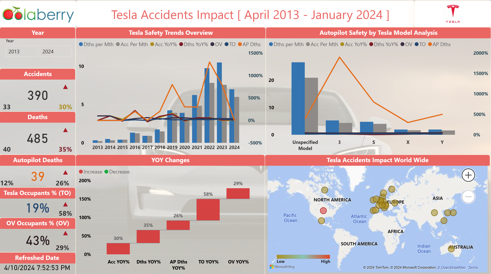

# Tesla-Safety-Assessment-Dashboard

## Tesla Accidents Impact from April 2013 to January 2024

### PowerBI Dashboard

### Executive Summary

### Background

Tesla has dramatically transformed the electric vehicle industry. This data science project utilizes advanced statistical methods such as Linear Regression, Decision Trees, and Autoregression models to explore how factors like model type, geographic location, and Autopilot usage influence accident severity and frequency. The insights generated aim to assist Tesla and regulatory bodies in enhancing vehicle safety and shaping effective future regulations.

### Problem Statement

Recent data from Fox Business shows that Tesla drivers had the highest accident rate between November 14, 2022, and November 14, 2023. This study extends the analysis from April 2013 to January 2024 to better understand the safety impacts of different Tesla models. It will examine correlations between model type, geographic location, Autopilot usage, and accident outcomes.

### Objectives

The primary objective of this project is to analyze Tesla accident data using advanced statistical methods to predict outcomes and identify key factors influencing accident dynamics. The findings aim to provide actionable insights that could improve safety features and inform regulatory decisions, thereby advancing electric vehicle safety and supporting both Tesla and automotive safety authorities in enhancing public safety.

### Data Overview
- **Data Source and KPIs**
  
The dataset for this project was sourced from TeslaAccidents.com, which meticulously tracks and documents Tesla-related accidents globally. This resource provides detailed data essential for analyzing the impact of variables like vehicle model, location, and Autopilot usage on the safety performance of Tesla's models.

- **Data Collection Methods**

In this project, advanced data analytics techniques were utilized to construct a sophisticated predictive framework using a combination of tools. Excel was employed for data organization, Python for data analysis and modeling, and Microsoft Power BI for data visualization, all integrated through Microsoft Fabric to enhance user interaction and interface design.

- **Data Modeling**

**This project's data model consists of five tables:**

1. **Waterfall Table**: This table supports the waterfall chart visualization, providing the necessary data points to display increases and decreases across various metrics.
2. **Data Refresh Table**: This table tracks all updates and refreshes that occur within the dataset, allowing for monitoring and auditing of data changes over time.
3. **Measures Table**: This table consolidates all the calculated measures and metrics used throughout the project, serving as a centralized repository for reusable calculations.
4. **Tesla Accident Table**: This is the main dataset, containing detailed information about Tesla-related accidents, which forms the core of the analysis.
5. **Calendar Table**: The calendar table is linked to the Tesla Accident table to synchronize date-related data, enabling time-based analysis and ensuring accurate filtering and grouping of events by time.

The relationships between these tables ensure efficient data processing and enable the seamless creation of visualizations and insights across various dimensions, such as time, metrics, and incident details.

  

- **Data Features**

The autoregression model for analyzing Tesla accident data incorporates key features such as time series data, vehicle models, specific locations, involvement of other vehicle occupants, Tesla driver demographics, Autopilot usage, deaths, and accident severity. These elements are combined to improve predictive accuracy and aid in understanding and forecasting accident frequencies and severities based on historical data and external factors.

### Methodology
- **Data Preparation**
  
Data underwent meticulous cleaning and normalization procedures to ensure precision in analysis. Feature selection prioritized variables that directly influence the frequency of Tesla accidents.

### Model Selection and Hyperparameters
 **Autoregression Model for Tesla Accidents**

- Autoregression models capture temporal patterns in Tesla accident data, offering predictive insights.
- They depict past and future accident frequencies and severities effectively, revealing hidden patterns.
- This choice aligns with the dynamic nature of Tesla accidents, aiming for comprehensive analysis.

**Tailored Hyperparameters**
- Choosing the appropriate autoregression order balances dependence and avoids overfitting.
- Regularization parameters promote simplicity and generalization, preventing overfitting.
- Optimizing window size and algorithms ensures efficient model performance.

**Conclusion**
- Autoregression models analyze Tesla accidents, revealing trends and dynamics effectively.
- Carefully selected hyperparameters ensure robustness and optimization.
- Autoregression, with tuned hyperparameters, provides valuable insights for safety measures.

  

  ### Model Development

In this phase, models were trained using historical Tesla accident data to analyze trends in accident occurrences over time. The primary objective was to predict future accident rates and devise strategies to reduce driving fatalities. Leveraging advanced techniques like autoregression, insights were gained to inform proactive measures for enhancing road safety and preventing future accidents.

#### Results
- **Model Performance**
  
The machine learning regression model showcases remarkable performance, attaining perfect scores across essential metrics such as R-squared (1.0), Mean Squared Error (0.0), Mean Absolute Error (0.0), Median Absolute Error (0.0), and Variance (1.0), reflecting accurate predictions of Tesla accident impacts. These results underscore its potential for safety analysis and interventions, emphasizing the need for validation on unseen data and considerations for interpretability and ethical use to ensure reliability.

**- Visualizations**

The dashboard provided below offers a detailed analysis of Tesla accident trends over time and autopilot accidents frequency categorized by different Tesla models. Through interactive visualizations, it vividly illustrates temporal accident evolution and identifies models with higher accident rates, providing valuable insights for safety assessments and intervention strategies.

### Case 1: Enhanced Safety Features for Tesla Models S and 3

**Objective:** To prioritize safety feature enhancements in Tesla models with a higher involvement in accidents.

**Positive Insight:** Models S and 3 follow with 48 and 52 accidents respectively, indicating these models may benefit from targeted safety improvements.

**#Model S**

**#Model 3**

**Negative Insight:** The **"Unspecified Model"** has the highest frequency of accidents (**251 Accidents**), suggesting a potential gap in data collection or a large number of incidents involving older or less common models. This insight suggests a need for better accident tracking and model identification.

### Return on Investment

**ROI Calculation:** Assuming a 10% reduction in accidents for Models S and 3 through enhanced safety features, with an average accident cost (including damages, insurance, and brand impact) of $50,000, 

Enhancing safety features in Tesla Models S and 3 could potentially prevent nearly **5 accidents** annually for each model, translating into savings of approximately **$240,000 for Model S and $260,000 for Model 3.**
This demonstrates the significant financial and safety benefits of investing in enhanced safety features for these models.

### Case 2: Autopilot Safety Improvement
 
**Objective:** Evaluate the role of Autopilot in accidents to inform safety protocol enhancements.

**Positive Insight:**  The data suggests that while Autopilot is involved in a small fraction **(12%)** of Tesla accidents, the noticeable increase in Autopilot-related fatalities **(26%)** and accidents involving Tesla passengers **(58%)** and other vehicles **(29%)** underscores the importance of enhancing safety features. This emphasizes the need for Tesla to continually improve Autopilot and passenger safety, enhancing trust in automated driving technology.

**Negative Insight:**  Safety concerns for Tesla's Autopilot are underscored by a **26% increase in Autopilot-related deaths** and significant rises in accidents involving Tesla passengers **(58%) and other vehicles (29%)**. This trend emphasizes the urgent need for ongoing improvements in Autopilot to enhance safety for all road users.

### Severity of Autopilot-Related Accidents:

Autopilot-related cases show a higher severity, with 11.79% of Tesla accidents involving Autopilot leading to 39 deaths. This indicates Autopilot incidents are more severe, underscoring the need for focused safety improvements and continuous advancements in technology and protocols to enhance safety and public trust in autonomous driving.

### Return on Investment

**ROI Calculations:**
- **Accidents Prevented:** 10% of Autopilot-related accidents
46×0.10 = 4.646×0.10 = 4.6  
For the sake of calculation, we'll round this to 5 accidents prevented annually.

-  **Cost Savings:** Savings from preventing these accidents.
5 × $50,000 = $250,000 × $50,000 = $250,000
Improving Autopilot safety to prevent 10% of related accidents could save $250,000 annually, highlighting the financial and safety benefits. This effort enhances public trust in Tesla's technology, emphasizing the value of continuous safety advancements.

### Impact
#### Solution Impact
- **Case 1: Model-Specific Safety Improvements**

Implementing model-specific safety enhancements presents a promising avenue for reducing accident costs and improving overall safety. By targeting specific models with higher accident rates, Tesla can effectively address underlying safety concerns and mitigate the associated financial losses.

- **Case 2: Autopilot Enhancements**

Focusing on enhancing Autopilot technology represents a strategic initiative to reduce severe accidents and enhance public trust in autonomous driving capabilities. By investing in Autopilot improvements, Tesla can leverage advanced driver assistance features to prevent accidents and enhance overall vehicle safety.

### Cases Comparison

### Business Outcomes
- **Case 1: Model-Specific Safety Improvements**
Implementing model-specific safety enhancements can lead to a reduction in accident-related costs and potential liabilities for Tesla. By addressing safety concerns in specific models, Tesla can enhance customer satisfaction and loyalty, ultimately improving brand reputation and market competitiveness.

- **Case 2: Autopilot Enhancements**

Investing in Autopilot enhancements can position Tesla as a leader in autonomous driving technology, fostering greater consumer confidence and market trust. By enhancing Autopilot features, Tesla can differentiate its products in the market, attract more customers, and potentially increase sales revenue while reducing the risk of severe accidents and associated costs.

- **Key Achievements**

### Lessons Learned and Future Work
**Challenges and Solutions**
- **Integration of Advanced Statistical Models**
  
I faced significant challenges integrating Python scripts into Microsoft Fabric, requiring extensive code revisions to ensure compatibility and functionality.
- **Accurate Major KPI Calculations**
  
I faced Calculation challenges of majors for key performance indicators like accident frequency and severity involved developing specialized Python scripts to handle missing or irrelevant data points effectively.
- **Optimal Model Selection**
  
Selecting the most effective predictive model was crucial; after extensive testing, we settled on the Autoregression model for its high accuracy and predictive reliability.

- **Lessons Learned**

The Tesla accidents project taught me the importance of adaptability in tool integration and the precision required in data handling. I learned the value of thoroughly testing predictive models to ensure their practical applicability and accuracy, emphasizing continual improvement for future analyses.

- **Future Directions**
  
Future capabilities aims at enhancing Tesla's safety ecosystem, featuring early accident detection, optimized emergency response, targeted vehicle safety improvements, policy guidance, and increased public awareness.

**References**

